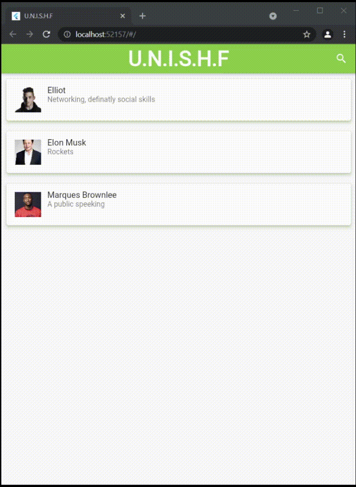
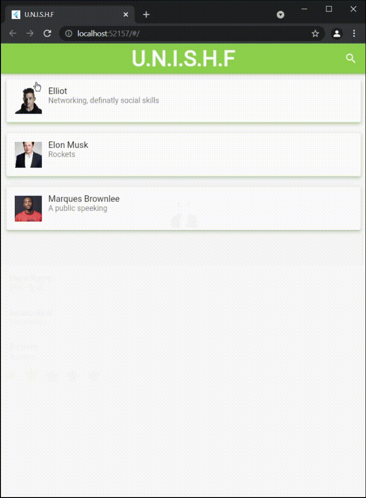

# Super Hero HR

## Description
It has a simple UI to manage heros H.R department. 

---

### In order to run the project you need the following: 
- Set up flutter enviroment
- To Test Android link the simulator 
- It is advisable to change the flutter the beta enviroment

## Demo

  - **Web**

 
| Rating | Sort & Search |
| :------------------: | :---------------------------: | 
|   |  |

 - **Android Phone**

 
| Rating | Sort & Search |
| :--------------------: | :---------------------------: | 
|   |  |

## **Issue Faced**
### The rating could not be fitted to All Hero page

 
| Android | Web |
| :-: | :-: |
|   |  |

## **Resourses Used**
I used the following tutorials and materials:
- [Setting up the enviroment](https://docs.flutter.dev/get-started/test-drive?tab=vscode)
- [Introduction to Flutter](https://www.youtube.com/watch?v=xWV71C2kp38)
- [How to create a filter search listview in flutter](https://www.kindacode.com/article/how-to-create-a-filter-search-listview-in-flutter/ )
- [Search In ListView & Filter ListView With JSON Data](https://www.youtube.com/watch?v=oFZIwBudIj0)
- [Navigation Basics](https://docs.flutter.dev/cookbook/navigation/navigation-basics)
- [Navigate with arguments](https://docs.flutter.dev/cookbook/navigation/navigate-with-arguments)
- [Examble of adding and deleting users](https://github.com/AhsanAyaz/flutter_contacts_list)
- [filter_listview_example](https://github.com/JohannesMilke/filter_listview_example)
- [Mr robot Image](https://www.pngitem.com/middle/hwbhwih_transparent-rami-malek-png-mr-robot-png-download/)
- [Marques Brownlee Image](https://www.pngitem.com/middle/hwbhwih_transparent-rami-malek-png-mr-robot-png-download/)
- [Elon Musk Image](https://en.wikipedia.org/wiki/Elon_Musk#/media/File:Elon_Musk_Royal_Society_(crop1).jpg)
- [Toggle Switch](https://api.flutter.dev/flutter/material/SwitchListTile-class.html)
- [Sorting](https://stackoverflow.com/questions/53547997/sort-a-list-of-objects-in-flutter-dart-by-property-value)
- [ **Rating Module** ](https://github.com/sarbagyastha/flutter_rating_bar)
- [ **Animated Icons** ](https://github.com/ibhavikmakwana/FlutterPlayground/blob/master/lib/ui/animatedicons/AnimatedIcons.dart)

### **Note**
The Rating Module and the animated icon are not my work, and all credits goas to the people who worked on them. The following are licenses to both:

- [ **Rating Module License** ](flutter_application_2/licenses/Rating_bar_license) 
- [ **Animated Icons** ](flutter_application_2/licenses/FlutterPlayground_LICENSE) 

 
